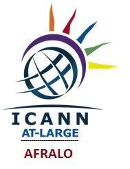

# // PHISHING DECODED
### Intermediate Phishing Awareness Comic by Gbemisola Esho

  

  <a href="https://apinke.github.io/phishing-decoded/"><strong>▶ Read the Live Comic</strong></a> &nbsp;·&nbsp;
  <a href="https://github.com/Apinke/phishing-decoded/fork">Fork this repo</a> &nbsp;·&nbsp;
  <a href="#license">License</a>

---

## About

**Phishing Decoded** is Volume 2 of the *Don't Get Hooked!* phishing awareness comic series. Designed for IT professionals, security practitioners, developers, and technically curious readers, it goes beyond awareness into the technical anatomy of phishing attacks and defences.

Rendered in a cyberpunk terminal aesthetic with code blocks, data tables, and system output — because serious technical content deserves an engaging format.

---

## 📖 What's Inside

| Module | Title | What You Learn |
|---|---|---|
| 01 | Anatomy of an Attack | OSINT reconnaissance, spear phishing lifecycle, infrastructure setup |
| 02 | URL Forensics | Domain vs subdomain, HTTPS myths, WHOIS age analysis |
| 03 | Email Header Analysis | SPF, DKIM, DMARC — reading authentication results |
| 04 | DGA & AI-Generated Domains | Domain Generation Algorithms, entropy analysis, AI-DGA evasion |
| 05 | Social Engineering | Cialdini's 6 principles, BEC (Business Email Compromise) |
| 06 | MFA & Its Limits | AiTM proxy attacks, TOTP bypass, FIDO2 phishing-resistance |
| 07 | Threat Intelligence | IOCs, VirusTotal, urlscan.io, crt.sh, MXToolbox |
| 08 | AI Detection Systems | ML feature pipelines, DNS-layer blocking, adversarial evasion |
| 09 | Organisational Defences | Defence-in-depth stack across DNS, email, identity, endpoint |
| 10 | IR Playbook | T+0 to T+60 incident response, credential reset, IOC sharing |

---

## 🌐 Live Demo

👉 **[https://apinke.github.io/phishing-decoded/](https://apinke.github.io/phishing-decoded/)**

Features:
- 🔄 Flip each page for analysis notes and implementation guidance
- ← → Navigate with buttons, arrow keys, or swipe
- 📋 Table of Contents — jump to any module
- 💻 Code blocks with syntax highlighting
- 📊 Data tables and system output formatting

---

## 📚 The Full Series

| Volume | Level | Repo |
|---|---|---|
| **Vol. 1 — Don't Get Hooked!** | ⭐ Beginner | [dont-get-hooked](https://github.com/Apinke/dont-get-hooked) |
| **Vol. 2 — Phishing Decoded** | ◈ Intermediate | This repo |
| **Vol. 3 — Advanced Threat Analysis** | ◈◈◈ Advanced | Coming soon |

Also by Gbemisola Esho:
- 📘 DNS Explained Simply
- 📗 DNSSEC: Securing DNS
- 🌐 DNS & AI: A Modern Saga
- ☁️ Cloud Security Demystified

---

## 🚀 How to Use

### Read Online
Visit: **https://apinke.github.io/phishing-decoded/**

### Fork and Customise
1. Click **Fork** → edit `index.html` → enable GitHub Pages in Settings
2. Share your customised version with your team or community

### Download and Host
1. Download `index.html` — works fully offline in any browser
2. Or drag and drop to [Netlify Drop](https://app.netlify.com/drop)

---

## 📝 License 

Licensed under [CC BY 4.0](http://creativecommons.org/licenses/by/4.0/) — free to share and adapt with attribution to **Gbemisola Esho**.

---

## 👩🏾‍💻 About the Author

**Gbemisola Esho** is a Google Developer Expert (GDE), Women Techmakers (WTM) Ambassador, and founder of [Connectobridge](https://connectobridge.com). She specialises in Cybersecurity and Cloud Computing and is a featured speaker at technology conferences across Africa and globally.

*Produced in association with AFRALO (African Regional At-Large Organisation) / ICANN At-Large.*

---

  <strong>// Stay sharp. Stay safe. Phishing decoded.</strong> 
  

